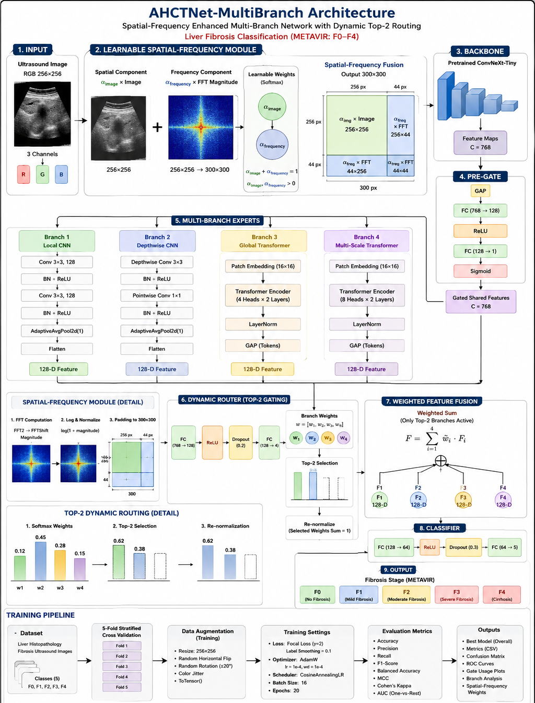

AHCTNet-Liver-Fibrosis
Adaptive Hybrid CNN-Transformer Network with Learnable Spatial-Frequency Augmentation for Liver Fibrosis Classification

  

 <b>PyTorch • ConvNeXt • CNN • Transformer • FFT • Adaptive Top-2 Routing • Medical Image Classification</b> 

Overview

AHCTNet is a hybrid multi-branch deep learning architecture developed for liver fibrosis image classification.

The model combines:

Learnable spatial-frequency image augmentation
FFT-based frequency-domain representation
A pretrained ConvNeXt-Tiny backbone
CNN and Transformer feature extraction branches
Adaptive sample-dependent branch routing
Sparse Top-2 branch selection
Weighted feature fusion
Focal Loss with label smoothing

The main objective is to jointly exploit spatial image information and frequency-domain characteristics while allowing the network to adaptively select the most informative feature-processing branches for each input sample.

Key Contributions

The main components of the proposed framework are:

Learnable Spatial-Frequency Augmentation

A differentiable preprocessing module combines the original spatial image with frequency-domain information extracted using the 2D Fast Fourier Transform (FFT).

Learnable Spatial/Frequency Weights

Two trainable parameters determine the relative contribution of spatial and frequency information:

$$
\alpha_{\text{image}} + \alpha_{\text{frequency}} = 1
$$

where both weights are obtained through a Softmax operation and optimized jointly with the network.

Hybrid CNN-Transformer Feature Extraction

Four parallel branches capture complementary representations:

Local CNN features
Depthwise CNN features
Global Transformer features
Multi-scale Transformer features

Adaptive Top-2 Routing

A routing network estimates the importance of the four branches for every input image and retains only the two highest-weighted branches.

Sparse Weighted Feature Fusion

The selected branch representations are normalized and combined using their learned routing weights before final classification.

Cross-Validation-Based Evaluation

The model is evaluated using stratified 5-fold cross-validation and multiple classification metrics.

Learnable Spatial-Frequency Augmentation

The original input image has size:

B × 3 × 256 × 256

where B denotes the batch size.

A frequency representation is independently extracted for every image and channel using:

FFT2
  ↓
FFT Shift
  ↓
Magnitude
  ↓
log(1 + magnitude)
  ↓
Per-channel Min-Max Normalization

Two global trainable logits are converted to normalized weights using Softmax:

α_image
α_frequency

such that:

α_image + α_frequency = 1

The spatial component is computed as:

Spatial = α_image × Input

The normalized FFT magnitude is resized to generate three frequency components:

Right frequency strip  : 256 × 44
Bottom frequency strip : 44 × 256
Corner frequency block : 44 × 44

These frequency regions are multiplied by α_frequency and concatenated with the spatial image.

The resulting network input is:

B × 3 × 300 × 300

with:

300 = 256 + 44

This design allows the contribution of spatial and frequency-domain information to be optimized end-to-end during training.

ConvNeXt-Tiny Backbone

A pretrained ConvNeXt-Tiny model is used as the main feature extractor.

models.convnext_tiny(
    weights=models.ConvNeXt_Tiny_Weights.DEFAULT
)

Only the feature extraction stages of ConvNeXt are used.

The backbone produces feature representations with:

Feature dimension = 768

These features are subsequently processed by the gating mechanism and the four parallel branches.

Pre-Gate Mechanism

Before sending the backbone feature map to the four branches, AHCTNet computes an adaptive gating coefficient.

The Pre-Gate consists of:

Adaptive Average Pooling
        ↓
Flatten
        ↓
Linear 768 → 128
        ↓
ReLU
        ↓
Dropout(0.2)
        ↓
Linear 128 → 1
        ↓
Sigmoid

The resulting coefficient g₁ modulates the feature map:

$$
F_{\text{gated}} =
F \times (0.5 + 0.5g_1)
$$

This operation adaptively controls the strength of the backbone representation before branch-specific processing.

Multi-Branch Feature Extraction

AHCTNet contains four parallel feature-processing branches.

Branch 1 — Local CNN

The first branch focuses on local convolutional representations.

Conv2D
768 → 256
3 × 3

↓
BatchNorm
↓
ReLU
↓
Dropout2D(0.2)
↓
Adaptive Average Pooling
↓
Linear
256 → 128

Output:

B × 128
Branch 2 — Depthwise CNN

The second branch uses depthwise separable convolution to capture local patterns efficiently.

Depthwise Conv2D
768 → 768
3 × 3
groups = 768

↓
Pointwise Conv2D
768 → 256
1 × 1

↓
BatchNorm
↓
ReLU
↓
Dropout2D(0.2)
↓
Adaptive Average Pooling
↓
Linear
256 → 128

Output:

B × 128
Branch 3 — Global Transformer

The third branch models global relationships between spatial tokens.

First, the backbone feature map is projected using:

Conv2D
768 → 128
kernel = 1 × 1

The feature map is then flattened into spatial tokens:

B × N × 128

and processed using a Transformer Encoder containing:

Transformer Encoder Layers : 2
Embedding Dimension         : 128
Attention Heads             : 4
Feed-Forward Dimension      : 512
Dropout                     : 0.1

Mean pooling across tokens produces:

B × 128
Branch 4 — Multi-Scale Transformer

The fourth branch combines convolutional spatial context with Transformer-based global modeling.

The initial projection uses:

Conv2D
768 → 128
kernel = 3 × 3
padding = 1

The resulting feature map is converted into spatial tokens and passed through:

Transformer Encoder Layers : 2
Embedding Dimension         : 128
Attention Heads             : 8
Feed-Forward Dimension      : 512
Dropout                     : 0.1

Mean pooling over the token dimension generates:

B × 128
Adaptive Router

The outputs of the four branches are stacked:

B × 4 × 128

A global feature vector is independently extracted from the gated ConvNeXt feature map using Adaptive Average Pooling.

The router receives the 768-dimensional global feature:

768
 ↓
Linear 768 → 128
 ↓
ReLU
 ↓
Dropout(0.2)
 ↓
Linear 128 → 4
 ↓
Softmax

This produces four sample-dependent branch weights:

$$
[w_1, w_2, w_3, w_4]
$$

Top-2 Sparse Gating

Instead of using all four branches equally, only the two branches receiving the highest routing weights are retained.

Router Weights
      ↓
Top-K Selection
K = 2
      ↓
Binary Mask
      ↓
Remove Non-selected Branches
      ↓
Weight Renormalization

The sparse routing weights satisfy:

$$
\sum_{i=1}^{4} w_i = 1
$$

after normalization.

This enables the network to dynamically select different feature-processing pathways for different input samples.

Weighted Feature Fusion

The selected branch representations are combined through weighted summation:

$$
\sum_{i=1}^{4} w_i F_i
$$

where only the Top-2 routing weights are non-zero.

The final fused representation has dimension:

B × 128
Classification Head

The fused representation is passed through:

Linear
128 → 64

↓
ReLU

↓
Dropout(0.3)

↓
Linear
64 → Number of Classes

The final output contains the classification logits.

Loss Function

The model is optimized using Focal Loss with label smoothing.

Configuration:

Gamma            = 2
Label Smoothing  = 0.1

The loss formulation emphasizes difficult samples while reducing the effect of highly confident predictions.

Dataset

The experiments are performed using the:

Liver Histopathology Fibrosis Ultrasound Images Dataset

Dataset source:

https://www.kaggle.com/datasets/vibhingupta028/liver-histopathology-fibrosis-ultrasound-images

The implementation automatically identifies class folders in the dataset directory and assigns numerical labels based on the sorted directory names.

The dataset itself is not included in this repository. Please download it directly from Kaggle.

Data Augmentation

Training images undergo the following transformations:

Resize → 256 × 256
Random Horizontal Flip
Random Rotation → ±20°
Color Jitter
    brightness = 0.2
    contrast   = 0.2
    saturation = 0.2
    hue        = 0.1
Convert to Tensor

Validation images use:

Resize → 256 × 256
Convert to Tensor
Experimental Setup
Parameter	Value
Input Size	256 × 256
Spatial-Frequency Output	300 × 300
Frequency Border	44 pixels
Backbone	ConvNeXt-Tiny
Backbone Initialization	ImageNet pretrained
Feature Dimension	768
Branch Feature Dimension	128
Number of Branches	4
Selected Branches	Top-2
Batch Size	16
Epochs	20
Optimizer	AdamW
Initial Learning Rate	1e-4
Weight Decay	1e-4
LR Scheduler	CosineAnnealingLR
Scheduler T_max	15
Cross Validation	Stratified 5-Fold
Random Seed	42
Loss	Focal Loss
Focal Gamma	2
Label Smoothing	0.1

The implementation automatically uses CUDA when available:

device = torch.device(
    "cuda" if torch.cuda.is_available() else "cpu"
)
Evaluation Metrics

The model is evaluated using:

Accuracy
Weighted Precision
Weighted Recall
Weighted F1 Score
Balanced Accuracy
Matthews Correlation Coefficient (MCC)
Cohen's Kappa
Multiclass ROC-AUC (One-vs-Rest)

Evaluation is performed independently for each validation fold.

The final implementation reports the mean and standard deviation across the five folds.

Model Analysis

In addition to conventional classification metrics, the implementation provides several tools for analyzing model behavior.

Branch Usage

Average routing weights are calculated for:

Branch 1 — CNN
Branch 2 — Depthwise CNN
Branch 3 — Transformer
Branch 4 — Multi-Scale Transformer

This allows investigation of which feature-processing strategies are favored by the adaptive router.

Class-Specific Branch Usage

Branch utilization is also computed independently for each class.

This analysis can help determine whether different fibrosis categories rely on different CNN or Transformer representations.

Spatial-Frequency Weight Evolution

The values of:

α_image
α_frequency

are recorded after every epoch.

Their evolution illustrates how the network learns the relative importance of spatial and frequency-domain information during training.

Visualizations

The implementation generates:

Training loss curves
Validation accuracy curves
Confusion matrices
Multiclass ROC curves
Average branch usage plots
Branch-usage-per-class heatmaps
Spatial/frequency weight evolution plots

The model stores metrics for every training epoch and identifies the best-performing model for each cross-validation fold.

## Experimental Results

The following results are reported as the mean ± standard deviation across the five validation folds of the stratified 5-fold cross-validation procedure.

| Metric | Mean ± Std |
|---|---:|
| Accuracy | **99.21% ± 0.21%** |
| Weighted Precision | **99.22% ± 0.21%** |
| Weighted Recall | **99.21% ± 0.21%** |
| Weighted F1 Score | **99.21% ± 0.21%** |
| Balanced Accuracy | **98.81% ± 0.33%** |
| Matthews Correlation Coefficient (MCC) | **98.97%** |

> **Note:** These results represent validation performance aggregated across 5-fold stratified cross-validation and are not results from an independent external test set.

### Learned Spatial-Frequency Fusion

The learnable spatial-frequency module converged to an approximately balanced contribution between spatial and frequency-domain information.

| Fusion Weight | Mean | Std |
|---|---:|---:|
| α_frequency | 0.4895 | 0.0004 |
| α_image | ≈ 0.5105 | ≈ 0.0004 |

Since:

$$
\alpha_{\text{image}} + \alpha_{\text{frequency}} = 1
$$

the learned fusion corresponds to approximately **51.05% spatial information** and **48.95% frequency-domain information**.

This near-balanced weighting suggests that both spatial and FFT-derived frequency representations contribute substantially to the final classification.

Final numerical results should be reported using the mean and standard deviation across all five validation folds.

Saved Outputs

Large model checkpoints are recommended to be distributed through GitHub Releases rather than committed directly to the repository.

Installation

Clone the repository:

git clone https://github.com/pezhman-najafie/AHCTNet-Liver-Fibrosis.git

cd AHCTNet-Liver-Fibrosis

Create a Python environment:

python -m venv .venv

Activate it on Windows:

.venv\Scripts\activate

or Linux/macOS:

source .venv/bin/activate

Install the required packages:

pip install -r requirements.txt
Dependencies

Core dependencies include:

Python
PyTorch
torchvision
NumPy
Pandas
scikit-learn
Matplotlib
Seaborn
Pillow
Running the Experiment

Download the dataset from Kaggle and specify its local path in the training script.

For example:

root = "/path/to/Dataset/Dataset"

Then run:

python train_ahctnet.py

Training performs the complete 5-fold cross-validation procedure automatically.

Reproducibility

The cross-validation procedure uses:

StratifiedKFold(
    n_splits=5,
    shuffle=True,
    random_state=42
)

For stronger reproducibility, deterministic PyTorch and NumPy seeds can additionally be configured before training.

Future Work

Potential directions for extending this work include:

Patient-level cross-validation when patient identifiers are available
Ablation studies for individual architectural components
Comparison against standard CNN and Transformer baselines
Explainability analysis using saliency or attribution methods
External validation on independent liver fibrosis datasets
Evaluation of alternative frequency-domain representations
Investigation of different sparse-routing strategies
Citation

If this repository contributes to your research, please cite or reference the GitHub repository.

Citation information will be updated if the work is published as a paper or preprint.

License

This project is released under the MIT License.

Disclaimer

This repository is intended for research and educational purposes only.

It is not intended for clinical diagnosis, medical decision-making, or direct clinical use.